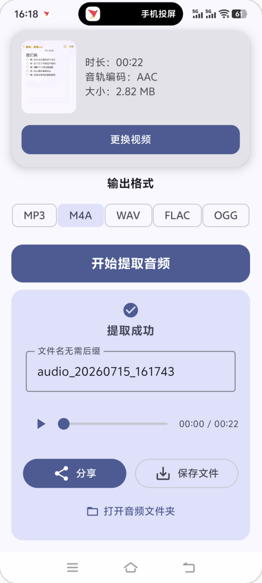

# 🎵 音频提取器 (AudioPeel)

**音频提取器 (AudioPeel)** 是一款基于 Android 的轻量级、无广告且完全免费的视频转音频极客工具。只需短短几秒，你就可以从手机相册的任意视频中完美抽离出所需的音频片段，并无损保存为你喜欢的格式！


## 📸 界面展示


---

## 🌟 核心功能特性

- **📸 极简视频选择器**  
  原生支持 Android 新版照片选择器 (`Photo Picker`)，极简、安全地读取和加载设备里的视频文件，无需额外申请读写权限。
  
- **🎵 多格式高保真无损输出**  
  内置强大的 `FFmpegKit` 作为转换引擎，自由定制你需要的音频格式：
  - **MP3**: 主流首选的高兼容格式
  - **M4A**: 占用空间更小且高品质
  - **WAV**: 无损原声格式，提供最佳后续剪辑质量
  - **FLAC**: 高品质无损压缩格式
  - **OGG**: 高效压缩格式
  
- **⏱️ 实时进度展示**  
  在转换或提取的进程中，直观显示解析与输出进度的环形进度条和准确的百分比读数。

- **🎧 内置播放预览**  
  提取或转换成功后，可直接在结果面板中通过底层的原生流媒体引擎 (`Media3 ExoPlayer`) 顺滑地试听音频片段，完美定制进度的丝滑拖拽反馈！

- **✏️ 自定义命名 & 📂 专属文件管理**  
  - 提取后可以直接重命名音频文件，告别杂乱的数字乱码名字。
  - 提取出的录音/音乐均会自动保存在你手机内部存储深处的专属文件夹 `/Music/AudioPeel` 中。
  - 支持一键调起 Android 系统文件管理器，快速跳转至专属音频抽屉查看。

- **🔗 应用内快捷无缝分享**  
  通过 Android `FileProvider` 实现全方位文件共享。提取成功后能立刻以文件的形式安全分享至微信、QQ、Telegram 甚至 AirDrop/互传 等任何常用通讯工具中。

---

## 🚀 技术栈与架构

本项目遵循 Google 推荐的最佳现代化架构实践，完全使用前沿原生方案构建：

- **开发语言**: 100% Kotlin
- **UI 框架**: Jetpack Compose (采用 Material Design 3 现代视效、全屏内容留白兼容输入法自适应 Edge-to-Edge)
- **多媒体处理架构**: FFmpegKit (`com.mrljdx:ffmpeg-kit-full`) 用于异步媒体指令高质量抽取操作。
- **音频引擎**: AndroidX Media3 `ExoPlayer`，提供稳健的高性能试听服务。
- **架构模式**: MVVM (Model-View-ViewModel) 和基于 `StateFlow` 的可观察响应式单向数据流机制。
- **文件存储规范**: 采用了完全兼容 Android 10+ 的 Scoped Storage（分区存储）的最新 MediaStore API 插入法则。

---

## 💻 本地编译指南

如果你想对本作进行二次开发或学习，可以按照下述环境要求进行配置与编译。

### 环境依赖
1. **Android Studio** (推荐版本 Iguana | 2023.2.1 或更新)
2. **Java 17+** (注：编译需兼容 Gradle 版本)
3. **Android SDK Level 36+** (建议 Target SDK API 36 以确保完全兼容最新的 SAF 选取器及通知等新系统特性)

### 编译步骤
1. 克隆本项目：
   ```bash
   git clone https://github.com/tianxing-ovo/AudioPeel.git
   ```
2. 使用 Android Studio 打开项目根目录。
3. 等待 Gradle 同步拉取依赖 (Compose Material3、FFmpegKit、ExoPlayer 等核心库)。
4. 插入你的实体手机或配置好环境的 Android 模拟器。
5. 点击上方工具栏的运行 (`Run 'app'`) 或者在底部 Terminal 键入指令 `./gradlew assembleDebug`。

---

## 💡 开发历程与已知优化项探索
在这个工程的演进过程中，我们持续解决并修复了诸多 Android 碎片化开发会碰到的典型历史课业难题。希望能为遇到同类问题的 Android 开发者提供些许思路：

- **SAF 路径兼容拦截**: 修复了 `SAF (Storage Access Framework)` 返回的 content uri 给 `ffmpeg` 时报错不可识别绝对路径的问题（采取了将其作为输入流读入，并自动写入同应用缓存沙盒环境内再执行转换，完毕后丢弃临时文件的缓冲策略）。
- **兼容全版本的媒体存储机制**: 从根源上梳理了新、老、旧几代 Android 的路径保存机制；对于 Android O 等过渡版本通过 `Documents Provider` 精确锚定 Music 文件夹实现快速路径定位，对更古董的设备则执行传统物理创建方法。
- **全面适配分区存储机制**: 对于 Android 10+ (Q) 及以上系统采用前卫安全的 `MediaStore.Audio.Media.EXTERNAL_CONTENT_URI` 指绝对相对路径写入，而不再像毒瘤应用一样申请“全盘外置存储强读权限”，真正让 APP 变成一款绿色、清爽又安全的纯工具。
- **精细雕琢的 MD3 交互**: 对自带的 Slider、ExoPlayer 控制器进行细节化重新排板，攻克了 Jetpack Compose 中多端事件同源时（如：后台媒体进度更新 vs 用户手指高频拖拽时的冲突）的进度弹回抖动问题，实现高度细腻的仿 iOS 阻尼级交互。

---

## 📜 许可证 (License)

本项目基于 [MIT License](LICENSE) 协议开源。欢迎任何出于学习、分享和二次创作的 Clone 使用。
